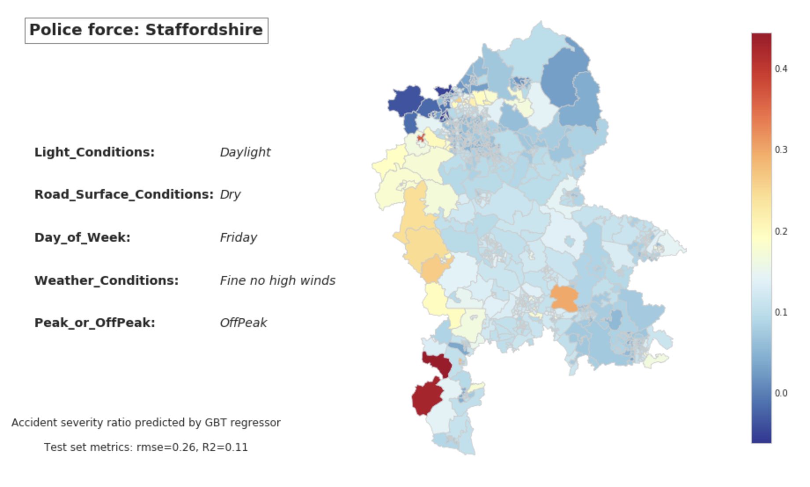

# Note 
Please open Code_Notebbok folder for code

# UK Road Safety: Traffic Accidents and Vehicles
This repository contains files produced for my MSML 651 Project

## Datasource
Detailed dataset of road accidents and involved vehicles in the UK (2005-2016) 
<U>https://www.kaggle.com/tsiaras/uk-road-safety-accidents-and-vehicles#Accident_Information.csv</U>
    

## Use case
<b>Predict accident severity at each output area (LSOA) given datetime and driving conditions</b>
<b>For each Police Force we build a prediction model with the following objective:</b> 
 
<em>Given date, time, weather, light and road conditions, predict accident severity within the operating geographic area of a police force</em>  
 

## Evaluation Result
In the evaluation phase, I conducted an assessment of the
Gradient Boosting Trees (GBT) model. The primary focus
was on predicting accident severity across the geographic
landscape of the United Kingdom, specifically within each
Output Area (LSOA). This evaluation involved considering
various factors, including the date and time of the accident, as
well as the prevailing driving conditions at the given locations

